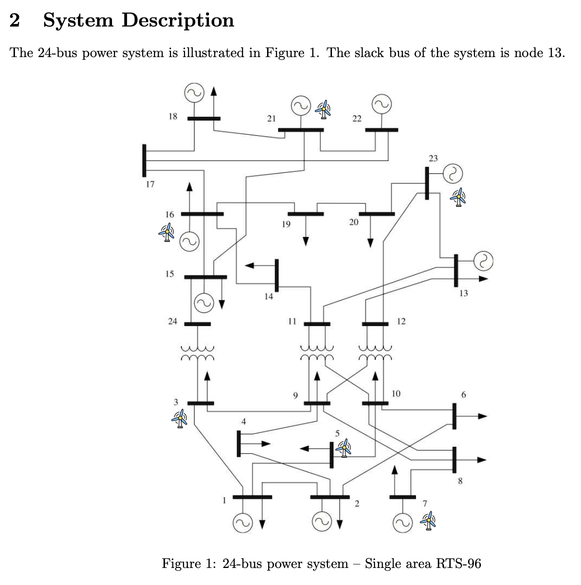

# Renewables in Electricity Markets: System Perspective

This Repo shows my solution to Assignment 1 proposed in the course "Renewables in Electricity Markets" from DTU in 2025. The chosen system is the IEEE 24-bus test reliability system, shown in the figure below. Data is in the file data/IEEE 24-bus reliability test system - data.xlsx.

The answers are written in the notebooks from Q1 to Q7.